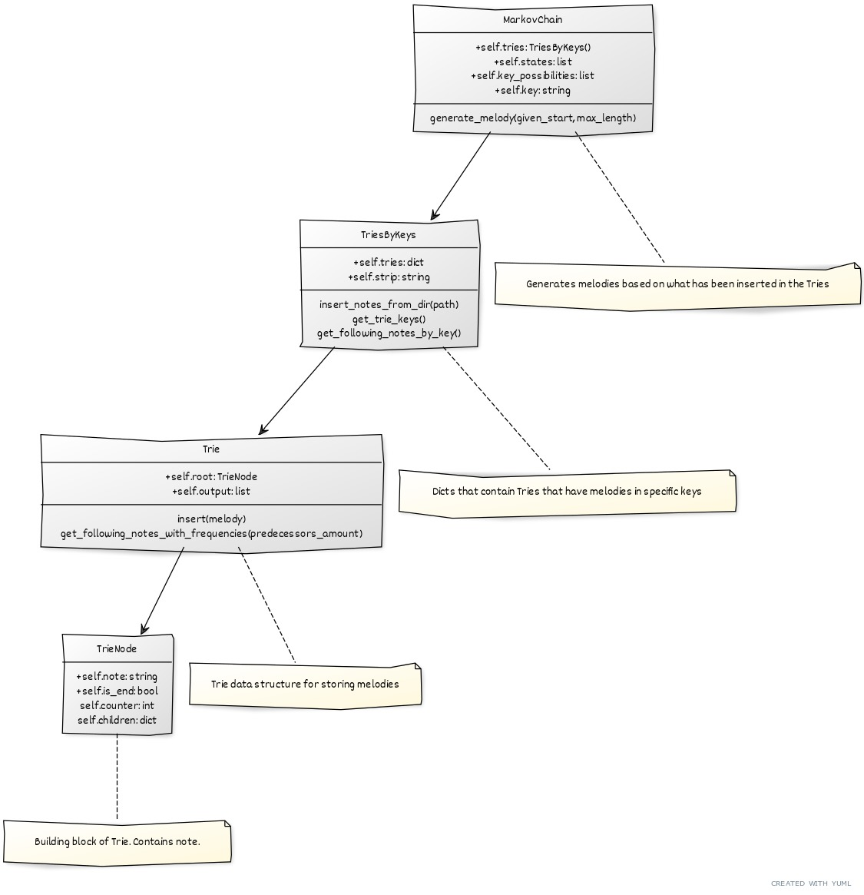

# Implementation of project

## General structure 

## Space and time complexity estimates

### Trie time complexity

Time complexity for looking up a melody is O(n) where n is the length of the melody to look up.

### Trie space complexity

Space complexity depends on the amount of nodes. A trie with N nodes will need O(N*k) space, where k is the number of unique notes that exist in melodies.